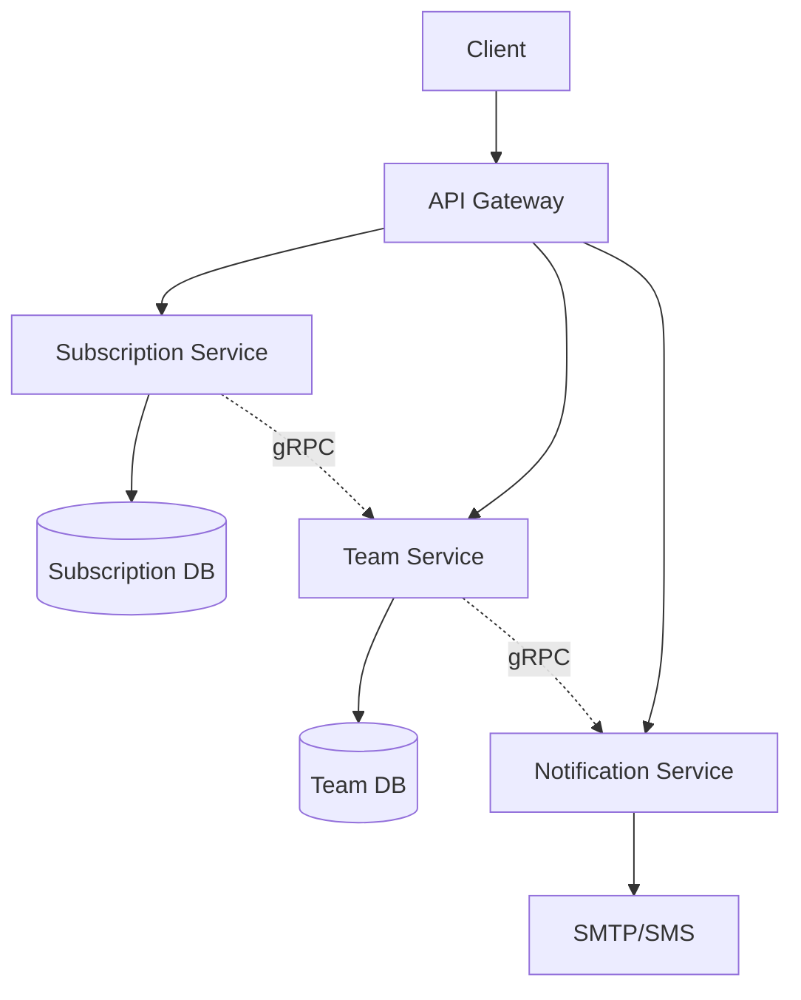

# Microservices Architecture Guide

This guide explains how to use SaaS Go Kit modules in a microservices architecture. While the library is designed for modular monoliths using Echo, the business logic can be extracted and used in microservices.

## 📋 Table of Contents

- [Overview](#overview)
- [Architecture Patterns](#architecture-patterns)
- [Implementation Approaches](#implementation-approaches)
  - [Approach 1: Service Layer Extraction](#approach-1-service-layer-extraction-recommended)
  - [Approach 2: API Gateway Pattern](#approach-2-api-gateway-pattern)
  - [Approach 3: Hybrid Architecture](#approach-3-hybrid-architecture)
- [Step-by-Step Implementation](#step-by-step-implementation)
- [Project Structure](#project-structure)
- [Service Communication](#service-communication)
- [Example: Building a Subscription Microservice](#example-building-a-subscription-microservice)
- [Best Practices](#best-practices)

## Overview

SaaS Go Kit modules provide:
- ✅ **Business Logic** (services, models, interfaces)
- ✅ **Database Models** (with GORM tags)
- ❌ **NOT for Microservices**: Echo handlers and HTTP routing

For microservices, you'll extract the business logic and wrap it in your preferred communication protocol (gRPC, REST, GraphQL).

## Architecture Patterns



## Implementation Approaches

### Approach 1: Service Layer Extraction (Recommended)

Extract the business logic from each module and wrap it in a microservice.

**Pros:**
- Clean separation of concerns
- Each service owns its data
- Technology independence
- Easy to scale

**Cons:**
- More boilerplate code
- Need to implement service communication

**When to use:** When building a true microservices architecture with separate databases and deployment units.

### Approach 2: API Gateway Pattern

Use the Echo modules in an API gateway that communicates with backend microservices.

**Pros:**
- Reuse existing HTTP handlers
- Single entry point for clients
- Can add cross-cutting concerns easily

**Cons:**
- Gateway becomes a potential bottleneck
- Still coupled to Echo framework

**When to use:** When you want a single HTTP API that delegates to microservices.

### Approach 3: Hybrid Architecture

Start with modules in a monolith and gradually extract services.

**Pros:**
- Incremental migration
- Lower initial complexity
- Can test microservices patterns gradually

**Cons:**
- Temporary complexity during migration
- Need to maintain two patterns

**When to use:** When migrating an existing monolith to microservices.

## Step-by-Step Implementation

### Step 1: Define Your Service Boundaries

```
subscription-service/     # Handles billing, plans, usage
├── Subscription logic
├── Payment processing
└── Usage tracking

team-service/            # Handles team members and permissions
├── User management
├── Team invitations
└── Role management

notification-service/    # Handles all communications
├── Email sending
├── SMS sending
└── Template management
```

### Step 2: Extract Models and Interfaces

Copy the relevant models and interfaces from the SaaS Go Kit modules:

```go
// subscription-service/models/subscription.go
package models

import (
    "github.com/karurosux/saas-go-kit/subscription-go"
)

// Use the models directly
type Subscription = subscription.Subscription
type SubscriptionPlan = subscription.SubscriptionPlan
type PlanFeatures = subscription.PlanFeatures
```

### Step 3: Implement Repositories

Create your database layer implementing the repository interfaces:

```go
// subscription-service/repositories/subscription_repo.go
package repositories

import (
    "context"
    "github.com/google/uuid"
    "github.com/karurosux/saas-go-kit/subscription-go"
    "gorm.io/gorm"
)

type SubscriptionRepository struct {
    db *gorm.DB
}

func NewSubscriptionRepository(db *gorm.DB) subscription.SubscriptionRepository {
    return &SubscriptionRepository{db: db}
}

func (r *SubscriptionRepository) Create(ctx context.Context, sub *subscription.Subscription) error {
    return r.db.WithContext(ctx).Create(sub).Error
}

func (r *SubscriptionRepository) FindByID(ctx context.Context, id uuid.UUID, preloads ...string) (*subscription.Subscription, error) {
    var sub subscription.Subscription
    query := r.db.WithContext(ctx)
    
    for _, preload := range preloads {
        query = query.Preload(preload)
    }
    
    err := query.First(&sub, "id = ?", id).Error
    return &sub, err
}

// Implement other methods...
```

### Step 4: Create Service Wrappers

Wrap the business logic in your chosen protocol:

```go
// subscription-service/grpc/server.go
package grpc

import (
    "context"
    "github.com/google/uuid"
    "github.com/karurosux/saas-go-kit/subscription-go"
    pb "your-company/subscription-service/proto"
)

type SubscriptionServer struct {
    pb.UnimplementedSubscriptionServiceServer
    service subscription.SubscriptionService
}

func NewSubscriptionServer(service subscription.SubscriptionService) *SubscriptionServer {
    return &SubscriptionServer{service: service}
}

func (s *SubscriptionServer) GetUserSubscription(
    ctx context.Context, 
    req *pb.GetSubscriptionRequest,
) (*pb.GetSubscriptionResponse, error) {
    accountID, err := uuid.Parse(req.AccountId)
    if err != nil {
        return nil, err
    }
    
    sub, err := s.service.GetUserSubscription(ctx, accountID)
    if err != nil {
        return nil, err
    }
    
    return &pb.GetSubscriptionResponse{
        Subscription: convertToProto(sub),
    }, nil
}
```

### Step 5: Implement Inter-Service Communication

Create clients for service-to-service communication:

```go
// team-service/clients/notification_client.go
package clients

import (
    "context"
    "github.com/karurosux/saas-go-kit/team-go"
    pb "your-company/notification-service/proto"
    "google.golang.org/grpc"
)

type NotificationClient struct {
    client pb.NotificationServiceClient
}

func NewNotificationClient(conn *grpc.ClientConn) team.NotificationService {
    return &NotificationClient{
        client: pb.NewNotificationServiceClient(conn),
    }
}

func (c *NotificationClient) SendTeamInvitation(
    ctx context.Context, 
    req *team.TeamInvitationNotification,
) error {
    _, err := c.client.SendEmail(ctx, &pb.SendEmailRequest{
        Template: "team_invitation",
        To:       []string{req.Email},
        Variables: map[string]string{
            "inviter_name": req.InviterName,
            "team_name":    req.TeamName,
            "role":         req.Role,
            "token":        req.Token,
        },
    })
    return err
}
```

## Project Structure

```
your-saas-platform/
├── services/
│   ├── subscription-service/
│   │   ├── cmd/
│   │   │   └── server/
│   │   │       └── main.go
│   │   ├── internal/
│   │   │   ├── repositories/    # Implement SaaS Go Kit interfaces
│   │   │   ├── grpc/           # gRPC server implementation
│   │   │   └── config/
│   │   ├── proto/
│   │   │   └── subscription.proto
│   │   ├── Dockerfile
│   │   └── go.mod
│   │
│   ├── team-service/
│   │   ├── cmd/
│   │   ├── internal/
│   │   │   ├── repositories/
│   │   │   ├── grpc/
│   │   │   └── clients/        # gRPC clients for other services
│   │   ├── proto/
│   │   └── Dockerfile
│   │
│   └── notification-service/
│       ├── cmd/
│       ├── internal/
│       └── Dockerfile
│
├── api-gateway/                 # Optional: HTTP gateway
│   ├── cmd/
│   ├── internal/
│   │   └── clients/            # gRPC clients for all services
│   └── Dockerfile
│
├── shared/
│   └── proto/                  # Shared protobuf definitions
│
└── docker-compose.yml
```

## Service Communication

### Using gRPC

```protobuf
// shared/proto/subscription.proto
syntax = "proto3";

package subscription;

service SubscriptionService {
    rpc GetUserSubscription(GetSubscriptionRequest) returns (GetSubscriptionResponse);
    rpc CreateCheckoutSession(CreateCheckoutRequest) returns (CreateCheckoutResponse);
    rpc CheckResourceLimit(CheckResourceRequest) returns (CheckResourceResponse);
}

message GetSubscriptionRequest {
    string account_id = 1;
}

message GetSubscriptionResponse {
    Subscription subscription = 1;
}

message Subscription {
    string id = 1;
    string account_id = 2;
    string plan_id = 3;
    string status = 4;
    int64 current_period_start = 5;
    int64 current_period_end = 6;
    Plan plan = 7;
}
```

### Service Discovery

For local development:
```yaml
# docker-compose.yml
version: '3.8'

services:
  subscription-service:
    build: ./services/subscription-service
    environment:
      - DB_HOST=subscription-db
      - GRPC_PORT=50051
    ports:
      - "50051:50051"

  team-service:
    build: ./services/team-service
    environment:
      - DB_HOST=team-db
      - GRPC_PORT=50052
      - NOTIFICATION_SERVICE=notification-service:50053
      - SUBSCRIPTION_SERVICE=subscription-service:50051
    ports:
      - "50052:50052"

  notification-service:
    build: ./services/notification-service
    environment:
      - GRPC_PORT=50053
      - SMTP_HOST=smtp.gmail.com
    ports:
      - "50053:50053"

  api-gateway:
    build: ./api-gateway
    environment:
      - PORT=8080
      - SUBSCRIPTION_SERVICE=subscription-service:50051
      - TEAM_SERVICE=team-service:50052
      - NOTIFICATION_SERVICE=notification-service:50053
    ports:
      - "8080:8080"
```

## Example: Building a Subscription Microservice

Here's a complete example of building a subscription microservice:

```go
// subscription-service/cmd/server/main.go
package main

import (
    "log"
    "net"
    "os"
    
    "github.com/karurosux/saas-go-kit/subscription-go"
    "google.golang.org/grpc"
    "gorm.io/driver/postgres"
    "gorm.io/gorm"
    
    "your-company/subscription-service/internal/grpc"
    "your-company/subscription-service/internal/repositories"
    pb "your-company/subscription-service/proto"
)

func main() {
    // Database connection
    dsn := os.Getenv("DATABASE_URL")
    db, err := gorm.Open(postgres.Open(dsn), &gorm.Config{})
    if err != nil {
        log.Fatal("Failed to connect to database:", err)
    }
    
    // Auto-migrate models
    db.AutoMigrate(
        &subscription.Subscription{},
        &subscription.SubscriptionPlan{},
        &subscription.SubscriptionUsage{},
    )
    
    // Create repositories
    subscriptionRepo := repositories.NewSubscriptionRepository(db)
    planRepo := repositories.NewPlanRepository(db)
    usageRepo := repositories.NewUsageRepository(db)
    
    // Create subscription service (from SaaS Go Kit)
    subscriptionService := subscription.NewSubscriptionService(
        subscriptionRepo,
        planRepo,
        usageRepo,
    )
    
    // Create usage service (from SaaS Go Kit)
    usageService := subscription.NewUsageService(
        usageRepo,
        subscriptionRepo,
    )
    
    // Create payment service with Stripe
    stripeProvider := subscription.NewStripeProvider()
    stripeProvider.Initialize(subscription.PaymentConfig{
        SecretKey:     os.Getenv("STRIPE_SECRET_KEY"),
        WebhookSecret: os.Getenv("STRIPE_WEBHOOK_SECRET"),
    })
    
    paymentService := subscription.NewPaymentService(
        stripeProvider,
        subscriptionRepo,
        planRepo,
    )
    
    // Create gRPC server
    grpcServer := grpc.NewServer()
    
    // Register services
    server := grpc.NewSubscriptionServer(
        subscriptionService,
        usageService,
        paymentService,
    )
    pb.RegisterSubscriptionServiceServer(grpcServer, server)
    
    // Start listening
    port := os.Getenv("GRPC_PORT")
    if port == "" {
        port = "50051"
    }
    
    lis, err := net.Listen("tcp", ":"+port)
    if err != nil {
        log.Fatal("Failed to listen:", err)
    }
    
    log.Printf("Subscription service listening on port %s", port)
    if err := grpcServer.Serve(lis); err != nil {
        log.Fatal("Failed to serve:", err)
    }
}
```

## Best Practices

### 1. **Database Per Service**
Each microservice should own its data:
```go
// Good: Each service has its own database
subscription-db   # Only subscription service accesses this
team-db          # Only team service accesses this
notification-db  # Only notification service accesses this

// Bad: Shared database
shared-db        # Multiple services access this
```

### 2. **API Versioning**
Version your service APIs:
```protobuf
// v1/subscription.proto
package subscription.v1;

// v2/subscription.proto  
package subscription.v2;
```

### 3. **Error Handling**
Convert library errors to gRPC status codes:
```go
import (
    "google.golang.org/grpc/codes"
    "google.golang.org/grpc/status"
)

func handleError(err error) error {
    if errors.IsNotFound(err) {
        return status.Error(codes.NotFound, err.Error())
    }
    if errors.IsBadRequest(err) {
        return status.Error(codes.InvalidArgument, err.Error())
    }
    return status.Error(codes.Internal, err.Error())
}
```

### 4. **Configuration Management**
Use environment variables or configuration service:
```go
type Config struct {
    Port              string
    DatabaseURL       string
    SubscriptionService string
    NotificationService string
}

func LoadConfig() *Config {
    return &Config{
        Port:              getEnv("PORT", "50051"),
        DatabaseURL:       getEnv("DATABASE_URL", ""),
        SubscriptionService: getEnv("SUBSCRIPTION_SERVICE", "localhost:50051"),
        NotificationService: getEnv("NOTIFICATION_SERVICE", "localhost:50053"),
    }
}
```

### 5. **Health Checks**
Implement health checks for each service:
```go
import "google.golang.org/grpc/health/grpc_health_v1"

func (s *HealthServer) Check(ctx context.Context, req *grpc_health_v1.HealthCheckRequest) (*grpc_health_v1.HealthCheckResponse, error) {
    // Check database connection
    if err := s.db.Ping(); err != nil {
        return &grpc_health_v1.HealthCheckResponse{
            Status: grpc_health_v1.HealthCheckResponse_NOT_SERVING,
        }, nil
    }
    
    return &grpc_health_v1.HealthCheckResponse{
        Status: grpc_health_v1.HealthCheckResponse_SERVING,
    }, nil
}
```

### 6. **Observability**
Add logging, metrics, and tracing:
```go
// Logging
log.Printf("Creating subscription for account: %s", accountID)

// Metrics
subscriptionCreatedCounter.Inc()

// Tracing
span, ctx := opentracing.StartSpanFromContext(ctx, "CreateSubscription")
defer span.Finish()
```

## Conclusion

While SaaS Go Kit is designed for monolithic applications using Echo, its clean architecture makes it suitable for microservices by:

1. **Extracting the service layer** - Use the business logic without the HTTP layer
2. **Implementing repository interfaces** - Connect to your databases
3. **Wrapping in gRPC/REST** - Expose services with your preferred protocol
4. **Creating service clients** - Enable inter-service communication

This approach gives you the benefits of the library's business logic while maintaining true microservice architecture principles.